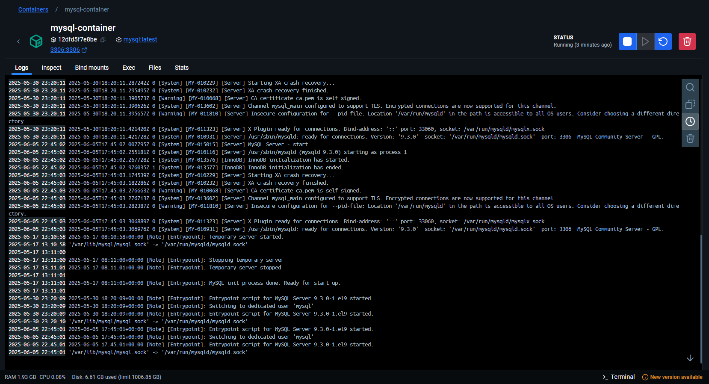
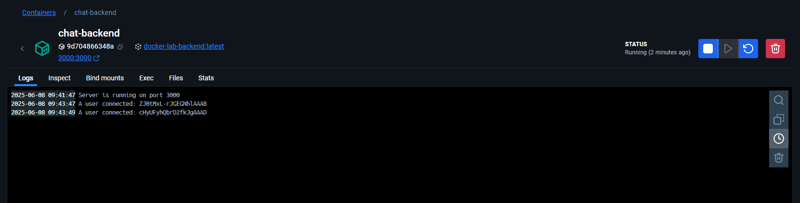
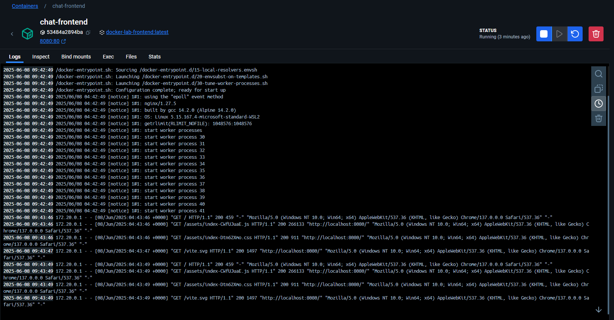

Dockerized Chat Application – Microservices-Based Architecture
Project Overview
This project is a microservices-based real-time chat application built using Docker to demonstrate containerization, networking, and volume management. The application comprises:

A React-based frontend for users to send and receive messages.

A Node.js backend API handling chat message logic and communication with the database.

A MySQL database running in a Docker container with a volume to persist chat data.

All components run in isolated containers connected through a custom Docker network, showcasing modular and scalable architecture.

Service	Technology
- Frontend: React.js
- Backend: Node.js (Express)
- Database: MySQL
- Docker: Networking, Volumes, Deploying

Docker Commands
- Network:
1. docker network create chat-network

- Database:

1. docker pull mysql:latest
2. docker run --name mysql-container -e MYSQL_ROOT_PASSWORD=haris -v mysql-data:/var/lib/mysql -p 3306:3306 -d mysql:latest

- Backend:

1. docker build -t docker-lab-backend ./backend
2. docker run -d --name backend-container --network chat-network -p 3000:80 docker-lab-backend

- Frontend:

1. docker build -t docker-lab-frontend ./frontend
2. docker run -d --name frontend-container --network chat-network -p 3000:80 docker-lab-frontend

Docker Logs

- Database

- Backend

- Frontend

DockerHub repository with pushed images link -> https://hub.docker.com/repositories/syedharisahmed

Creative Enhancements:

This project goes beyond basic Dockerization by:

1. Avoiding Docker Compose intentionally, showcasing manual container orchestration with a user-defined network.

2. Using multi-stage Docker builds to minimize image size for the frontend.

3. Applying Docker volumes for persistent MySQL data even after container restarts.

4. Structuring the microservices in a production-friendly way, making future CI/CD integration and container orchestration (e.g., Kubernetes) easier.